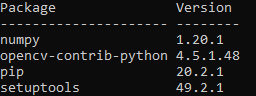

# CapDetect

El propósito del presente proyecto consiste en la identificación de condensadores en placas electrónicas para su posterior extracción y reaprovechamiento. Para realizar dicha tarea se implementará un algoritmo de visión artificial que identifique estos condensadores en imágenes dadas.
En nuestro caso, la captura de imágenes se realiza en condiciones controladas, automáticas y repetibles. De esta forma, todas las imágenes se tomarán de forma cenital con iluminación controlada. Este sistema es propiedad del cliente _José Francisco Vélez Serrano_. El algoritmo que se implementa recibirá las imágenes de dicho sistema y devolverá un listado de puntos respecto al origen de la imagen (esquina superior izquierda).

### Instalación de Python y las bibliotecas necesarias

Para poder ejecutar este sistema es necesario instalar la versión de Python 3.8 o superior. Las bibliotecas empleadas son:

	* OpenCV-contrib-python
	* Numpy

Para instalar __Python__ acuda a la [página web](https://www.python.org/downloads/) y seleccione la versión de __Python__ de interés.
Para instalar las bibliotecas necesarias se recomienda crear un entorno de trabajo. Si lo desea, puede crear un entorno de trabajo con siguiente comando desde la consola:

```
python -m venv NOMBRE_DEL_ENTORNO
```

Si se ha creado un entorno, deberá activarlo antes de continuar. Para ello, según se encuentre en Windows o Linux, realicé el siguiente comando:

* Windows:

  ​	

  ```
  NOMBRE_DEL_ENTORNO\Scripts\activate
  ```

* Linux:

  ```
  source NOMBRE_DEL_ENTORNO/bin/activate
  ```

Si ha creado un entorno, asegúrese de que el nombre del mismo se muestra en pantalla. Una vez se tiene el entorno en el que se desean instalar las librerías realice el siguiente comando:

```
python -m pip install opencv-contrib-python numpy
```

Si lo prefiere, puede descargar el archivo `requirements.txt`e introducir el siguiente comando en la consola:

```
python -m pip install -r requirements.txt
```

Si se han completado todos los pasos correctamente el siguiente comando debería obtener el resultado similar al mostrado en la imagen (las versiones pueden ser distintas en función del momento en que se realice la instalación de las bibliotecas y la forma en que se haga).

```
python -m pip list
```



### Clonar el repositorio

Para clonar el repositorio asegúrese de disponer de una versión de __git__, en caso de no tenerla puede descargarla desde su [página web](https://git-scm.com/downloads).

Abra una consola y acceda a la ruta donde quiere almacenar el repositorio, por ejemplo en "Mis Documentos". Para ello en la consola deberá ejecutar el comando `cd DIRECTION`donde "DIRECTION" es la carpeta a la que quiere acceder.

Una vez en la carpeta de interés debe ejecutar el siguiente comando:

```
git clone https://github.com/davidmubernal/AIVA_2021_CapDetect.git
```

Una vez finalizado el proceso debería tener una carpeta llamada `AIVA_2021_CapDetect`.

### Ejecución del programa

Para ejecutar el programa debe abrir la consola en la carpeta donde se encuentre el conjunto de funciones. En la consola debe poner el siguiente comando donde donde `DIRECCION_A_IMAGEN` será la ruta completa hasta la imagen a probar.

```
python main.py -image=DIRECCION_A_LA_IMAGEN
```

Si se desea almacenar la imagen obtenida por el programa se debe incluir una `DIRECCION_SALIDA` donde almacenar la imagen.

```
python main.py -image=DIRECCION_A_LA_IMAGEN -output=DIRECCION_SALIDA
```

Por ejemplo, se puede ejecutar con alguna de las imágenes de prueba que se encuentran en la dirección `img/test` como la imagen `rec1-3.jpg`. A continuación se muestra el comando para ejecutar el algoritmo con esta imagen

```
python main.py -image=img/test/rec1-3.jpg
```

> __Nota__: en este momento la función devuelve por pantalla las posiciones de los condensadores en una listado de vectores. Estos vectores están compuestos por [posición_x, posición_y, radio]

Si además de obtener por pantalla el resultado se desea guardar la imagen para visualizar los condensadores detectados el ejemplo sería como se muestra a continuación:

```
python main.py -image=img/test/rec1-3.jpg -output=result
```

De esta forma, dentro de la carpeta `result` se encontrará el siguiente resultado:


### Ejecución de los test

Si se desean ejecutar los test se debe ejecutar el siguiente comando:

```
python capacitor_test.py
```

